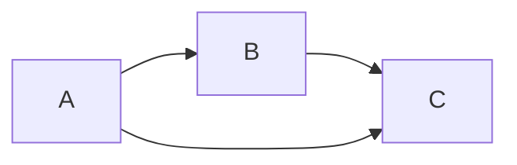

# Markdown Examples

## Diagram


## Python Code
```python 
   x = np.array([1,2,3,4,5,6,7,8,9,10])
   x[-10,-9,-8,-7,-6] ==> [1,2,3,4,5]
```

## Math
$$x = {-b \pm \sqrt{b^2-4ac} \over 2a}$$
$$ \sqrt[5]{34}$$
$$\sum_{n=1}^n n^2 = {n \over 6} (n + 1)(2n + 1) $$

## Tables
Colons can be used to align columns.

| Tables        | Are           | Cool  |
| ------------- |:-------------:| -----:|
| col 3 is      | right-aligned | $1600 |
| col 2 is      | centered      |   $12 |
| zebra stripes | are neat      |    $1 |

